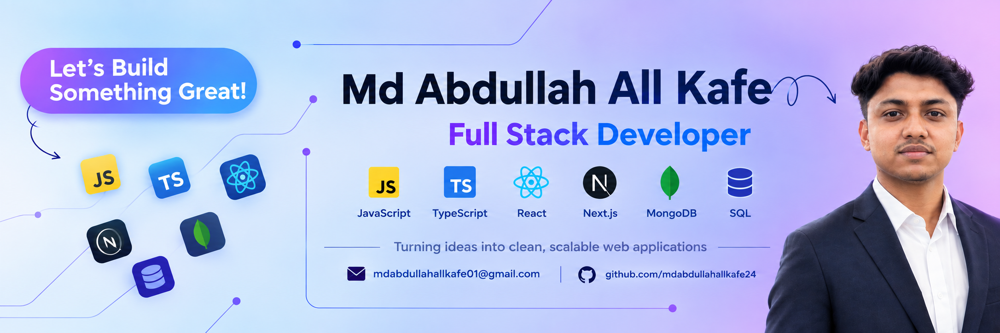

  

<h1 align="center">Hi 👋, I'm Md Abdullah All Kafe</h1>

<h3 align="center">Full Stack Developer from Bangladesh 🇧🇩</h3>

  I’m a CSE student passionate about building modern, scalable, and user-friendly web applications.

  I enjoy turning ideas into real-world projects and continuously improving my skills through learning and building.

### 👨‍💻 About Me

- 🎓 Computer Science & Engineering student
- 💻 Focused on Full Stack Web Development
- 🌱 Currently improving my skills in React, Next.js, Next.js and modern web technologies
- 🚀 Interested in building clean, responsive and scalable applications
- 🧠 Practicing problem solving and programming
- 🤝 Open to learning, collaboration and exciting projects

<h2 align="center">🤝 Connect With Me</h2>

  
  &nbsp;&nbsp;&nbsp;&nbsp;

  
  &nbsp;&nbsp;&nbsp;&nbsp;

  
  &nbsp;&nbsp;&nbsp;&nbsp;

  

  <b>LinkedIn</b>
  &nbsp;&nbsp;&nbsp;&nbsp;&nbsp;&nbsp;
  <b>Email</b>
  &nbsp;&nbsp;&nbsp;&nbsp;&nbsp;&nbsp;
  <b>GitHub</b>
  &nbsp;&nbsp;&nbsp;&nbsp;&nbsp;&nbsp;
  <b>Facebook</b>

  <i>Let's connect, collaborate, and build something meaningful together.</i>

<h2>🛠️ Technology Stack</h2>

<h3>💻 Languages</h3>

  
  &nbsp;
  
  &nbsp;
  
  &nbsp;
  

<h3>🎨 Frontend</h3>

  
  &nbsp;
  
  &nbsp;
  
  &nbsp;
  
  &nbsp;
  

<h3>⚙️ Backend</h3>

  
  &nbsp;
  

<h3>🗄️ Database</h3>

  
  &nbsp;
  

<h3>🧰 Tools & Others</h3>

  
  &nbsp;
  
  &nbsp;
  

